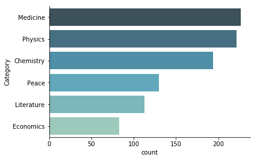
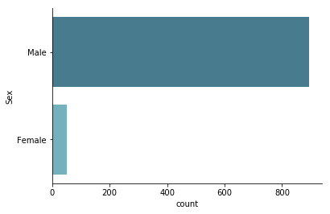
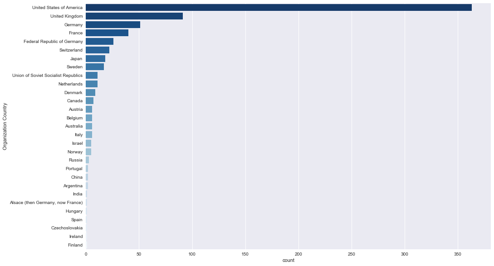
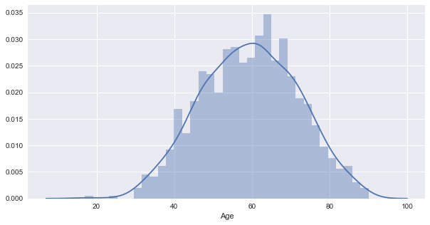
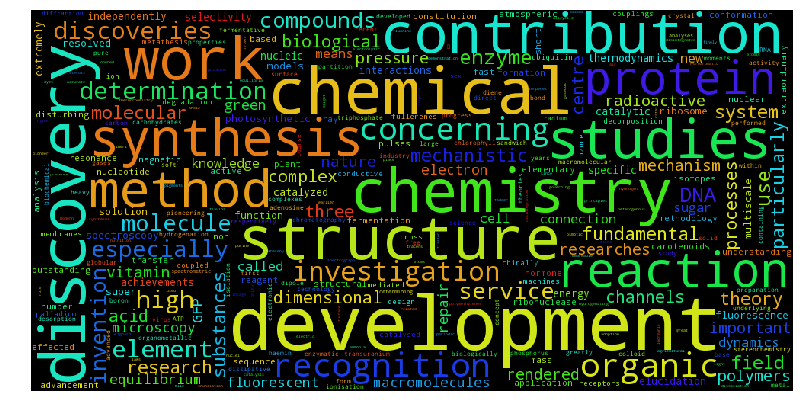

# Analysis of Nobel Laureates from 1901-present

**Data obtained from Kaggle**

This is a preliminary analysis of the dataset that addresses the following questions:

1. How many categories are there and how are they distributed?
2. How does females compare to male laureates?
3. What is the distribution of awards by country
4. What is the predominant age of the laureates?

Results:

There are six categories: Medicine, Physics, Chemistry, Peace, Literature and Economics. The field of Medicine had the highest number of awards given.

Males dominated the population of awardees.

The United States also dominated other countries in terms of number of people awarded.

Most of the Laureates are aged around 60 years old.

**In short, you have a shot at a Nobel Prize if you are:**

1. a male
2. in the area of medicine
3. living in the USA
4. around 60 years old

Word cloud for motivations for Chemistry Nobel:

